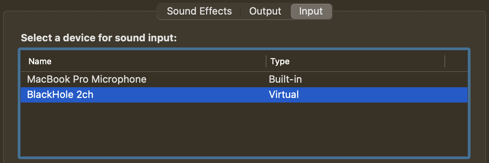

# Spotiripper

## Usage

    spotiripper <track URI>
    spotiripper <track URL>")
    spotiripper <list.txt containing track URIs or URLs>
    spotiripper <playlist URI>    Note: requires setting Spotify Client ID and Client Secret keys.
    spotiripper <playlist URL>    Note: requires setting Spotify Client ID and Client Secret keys.
    spotiripper <album URI>       Note: requires setting Spotify Client ID and Client Secret keys.
    spotiripper <album URL>       Note: requires setting Spotify Client ID and Client Secret keys.

## Non-Python Dependencies
### Spotify
Better if with a paid account to get rid of ads.

###[Blackhole](https://existential.audio/blackhole/)
To route the audio stream internally.
If you also want to listen to the music while recording you will need to create an aggregate output device (red circle). In this case it's important to set the BlackHole virtual device bitrate to the same bitrate of the speakers (48kHz) otherwise this nasty error appears at random `||PaMacCore (AUHAL)|| Error on line 2500: err='-10863', msg=Audio Unit: cannot do in current context`.

Make sure the volume slider in BlackHole is set to 1.0 (0.0dB) not to have an attenuated recording. If this is necessary for whatever reason, it's still possible to recover that in spotiripper (`gaindb` parameter in `converter_pydub.py`).
