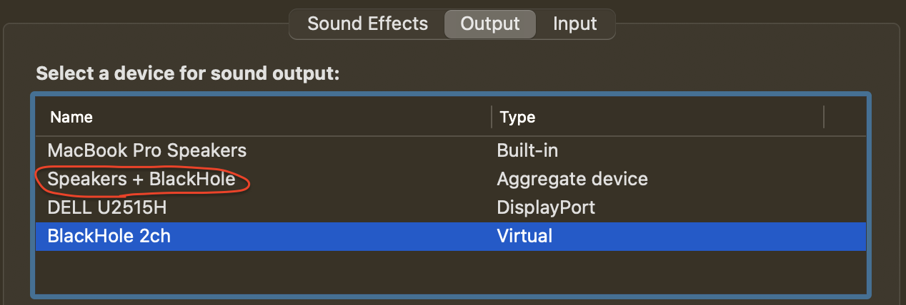

# Spotiripper

## Download
[Built on MacOS 12.0.1.](dist/spotiripper)

## Usage

    spotiripper <track URI>
    spotiripper <track URL>")
    spotiripper <list.txt containing track URIs or URLs>
    spotiripper <playlist URI>    Note: requires setting Spotify Client ID and Client Secret keys.
    spotiripper <playlist URL>    Note: requires setting Spotify Client ID and Client Secret keys.
    spotiripper <album URI>       Note: requires setting Spotify Client ID and Client Secret keys.
    spotiripper <album URL>       Note: requires setting Spotify Client ID and Client Secret keys.

If you get an error like `UnicodeEncodeError: 'ascii' codec can't encode characters in position 1-57: ordinal not in range(128)`, set the LANG variable in the terminal with:

````
export LANG="en_US.UTF-8"
````

## Python settings
Developed and tested with Python 3.9.7.
Built with pyinstaller.

## Non-Python Dependencies
### Spotify
Better if with a paid account to get rid of ads.

### Blackhole
[Download](https://existential.audio/blackhole/)

[Github](https://github.com/ExistentialAudio/BlackHole/wiki)

To route the audio stream internally.
If you also want to listen to the music while recording you will need to create an aggregate output device (red circle). In this case it's important to set the BlackHole virtual device bitrate to the same bitrate of the speakers (48kHz) otherwise this nasty error appears at random `||PaMacCore (AUHAL)|| Error on line 2500: err='-10863', msg=Audio Unit: cannot do in current context`.




Make sure the volume slider in BlackHole is set to 1.0 (0.0dB) not to have an attenuated recording. If this is necessary for whatever reason, it's still possible to recover that in spotiripper (`gaindb` parameter in `converter_pydub.py`).

## Bugs
Both pyaudio and sounddevice, sometimes, although the input device is set correctly to blackhole, pstart recording from the microphone and then crash when attempting to close the stream.

````
Ripping track spotify:track:56wHTRjWMtWZ8RBKN1gcnj...                                                         
********************************************************************************
Portaudio version
(1246976, 'PortAudio V19.7.0-devel, revision unknown')

Recording file
tmp/tmp.wav

All devices
  0 DELL U2515H, Core Audio (0 in, 2 out)
* 1 BlackHole 2ch, Core Audio (2 in, 2 out)
  2 MacBook Pro Microphone, Core Audio (1 in, 0 out)
  3 MacBook Pro Speakers, Core Audio (0 in, 2 out)
  4 ZoomAudioDevice, Core Audio (2 in, 2 out)
  5 Speakers + BlackHole, Core Audio (0 in, 2 out)

Device that will be used:
Device #: 1
Channels: 2
Rate #: 48000
********************************************************************************
||PaMacCore (AUHAL)|| Warning on line 520: err=''!obj'', msg=Unknown Error
||PaMacCore (AUHAL)|| Warning on line 436: err=''!obj'', msg=Unknown Error
||PaMacCore (AUHAL)|| Error on line 1303: err='-10851', msg=Audio Unit: Invalid Property Value
Exception in thread Thread-3:
Traceback (most recent call last):
  File "/Users/ste/.pyenv/versions/3.9.7/lib/python3.9/threading.py", line 973, in _bootstrap_inner
    self.run()
  File "/Users/ste/.pyenv/versions/3.9.7/lib/python3.9/threading.py", line 910, in run
    self._target(*self._args, **self._kwargs)
  File "/Users/ste/PycharmProjects/spotiripper/recorder_sounddevice.py", line 113, in _record
    with sd.InputStream(samplerate=self.rate,
  File "/Users/ste/.pyenv/versions/3.9.7/lib/python3.9/site-packages/sounddevice.py", line 1415, in __init__
    _StreamBase.__init__(self, kind='input', wrap_callback='array',
  File "/Users/ste/.pyenv/versions/3.9.7/lib/python3.9/site-packages/sounddevice.py", line 892, in __init__
    _check(_lib.Pa_OpenStream(self._ptr, iparameters, oparameters,
  File "/Users/ste/.pyenv/versions/3.9.7/lib/python3.9/site-packages/sounddevice.py", line 2741, in _check
    raise PortAudioError(errormsg, err)
sounddevice.PortAudioError: Error opening InputStream: Internal PortAudio error [PaErrorCode -9986]
````